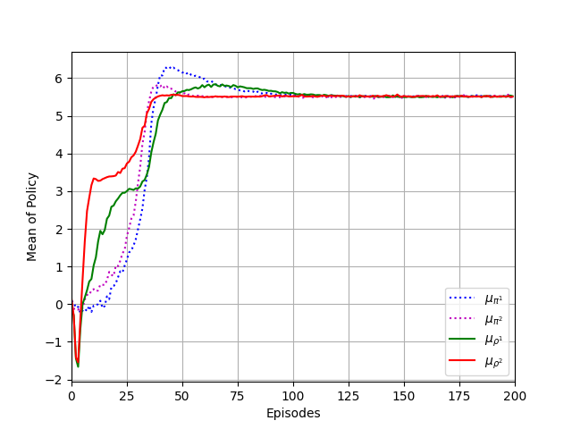

# ROMMEO-AC
This repository is the implementation of the paper, [A Regularized Opponent Model with Maximum Entropy Objective](https://arxiv.org/abs/1905.08087).  
In the corresponding paper, the experiments were conducted on two environments, Iterated Matrix Games and Differential Games.  
However, in this implementation, I only implemented for Differential Games.  
I referred to the original authors' codes written in TensorFlow and converted the TensorFlow to PyTorch.  

For training and getting results:  
`python main.py`

Results:  
| Return | Policy |
|---|---|
|  |  |

---
## References:
[The repository of the paper](https://github.com/rommeoijcai2019/rommeo)
 - This repository provides the codes which are written in TensorFlow.